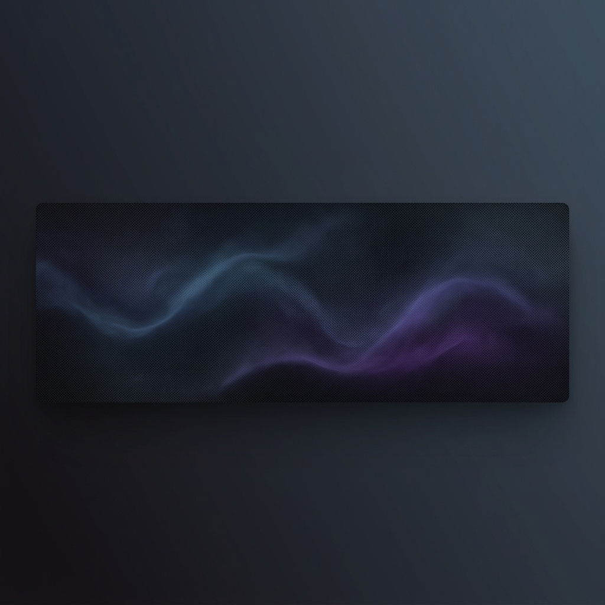

<!-- 
 -->
  <!--  -->
<!-- 
 -->

# Hi there, I'm Arun 👋

I am a software engineer focused on building clean, efficient, and scalable web applications. I value clean code, testability, and developer experience.

---

### 💻 About Me

- 🔭 **Current Focus**: Building full-stack web applications and refining developer workflows.
- 🛠️ **Engineering Practices**: Emphasizing modular architecture, test-driven development, and database performance optimization.
- 📖 **Learning & Growth**: Exploring systems design patterns, distributed architecture, and backend systems in Go/Rust.

---

### 🛠️ Tech Stack

**Languages & Runtimes**

  
  
  
  
  

**Frameworks & Libraries**

  
  
  
  

**Tools & Databases**

  
  
  
  

---

### 📊 GitHub Stats

  

